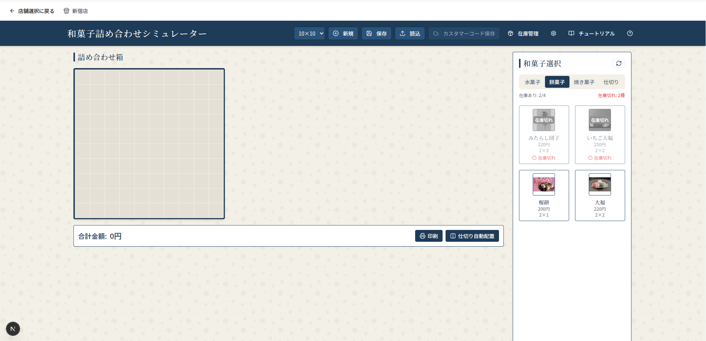
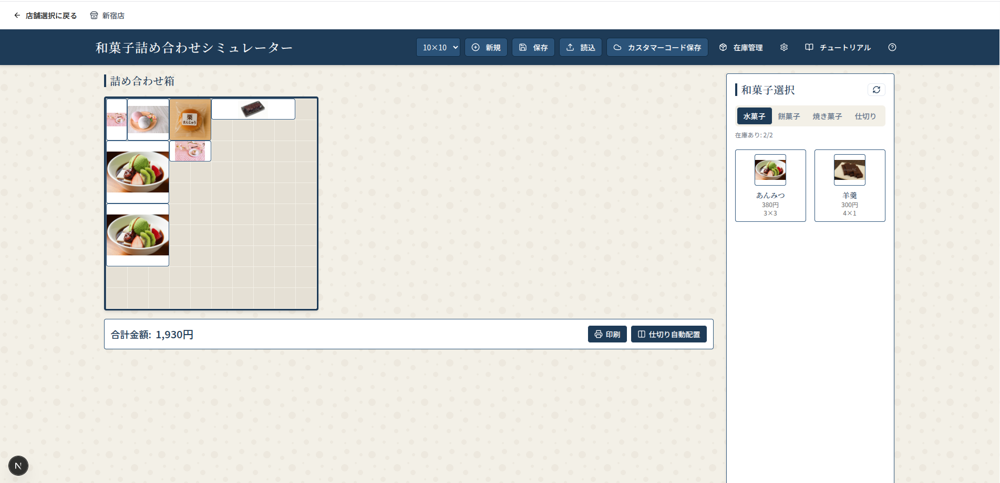
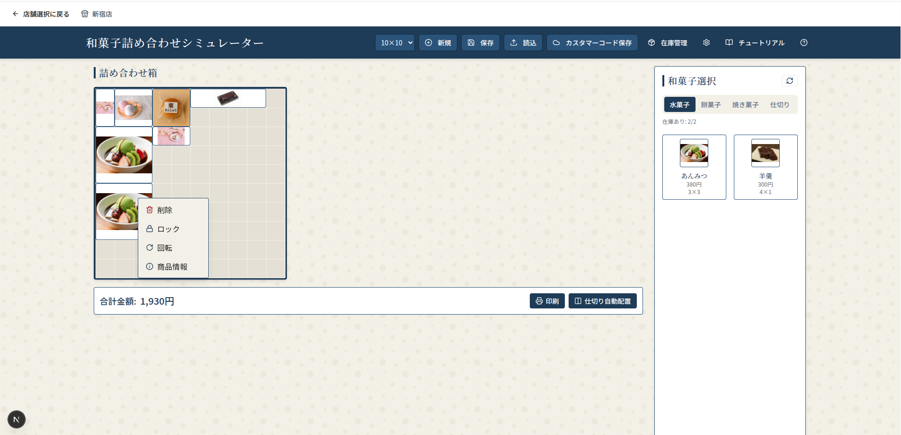
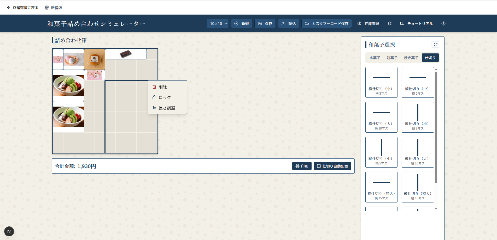
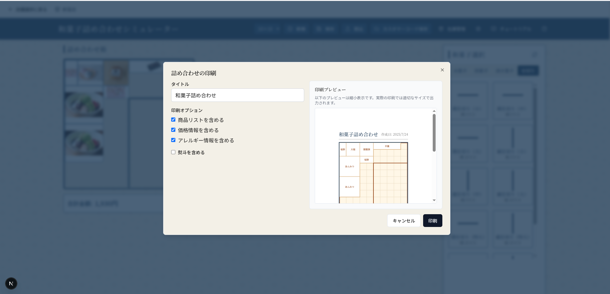

# 和菓子詰め合わせシミュレーター 操作説明書

## 目次
1. [はじめに](#はじめに)
2. [基本操作](#基本操作)
3. [詳細機能](#詳細機能)
4. [保存・読み込み機能](#保存読み込み機能)
5. [印刷機能](#印刷機能)
6. [トラブルシューティング](#トラブルシューティング)

---

## はじめに

和菓子詰め合わせシミュレーターは、お客様のお好みに合わせて和菓子の詰め合わせを視覚的にデザインできるツールです。ドラッグ＆ドロップの簡単操作で、美しい詰め合わせを作成できます。

### 主な機能
- 和菓子の配置シミュレーション
- 仕切りの自動・手動配置
- 価格計算機能
- 印刷・保存機能
- カスタマーコード保存機能

---

## 基本操作

### 1. 画面構成

画面は以下の3つの主要エリアで構成されています：

- **ヘッダー**: 各種設定ボタンと保存・読み込み機能
- **箱エリア（左側）**: 和菓子を配置するメインエリア
- **選択エリア（右側）**: 和菓子と仕切りを選択するエリア

### 2. 箱サイズの選択

ヘッダー左上のドロップダウンメニューから箱のサイズを選択できます：
- **10×10**: 小さめの詰め合わせ
- **15×15**: 中サイズの詰め合わせ  
- **20×20**: 大きめの詰め合わせ

### 3. 和菓子の選択と配置

#### 和菓子の選択
1. 右側の選択エリアでカテゴリタブをクリック
   - 焼き菓子、餅菓子、水菓子、干菓子、蒸し菓子、季節限定、伝統菓子
2. お好みの和菓子をクリックして選択

#### 和菓子の配置
1. 選択した和菓子を**ドラッグ**
2. 左側の箱エリアの好きな位置に**ドロップ**
3. グリッド上に和菓子が配置されます

### 4. 基本的な編集操作

#### 和菓子の移動
- 配置済みの和菓子をドラッグして移動
- 矢印キー（↑↓←→）でも移動可能

#### 和菓子の削除
- 和菓子を右クリック → 「削除」を選択
- または和菓子を選択してDeleteキーを押す

---

## 詳細機能

### 1. コンテキストメニュー（右クリックメニュー）

配置済みの和菓子を右クリックすると、以下の操作が可能です：

- **削除**: 和菓子を削除
- **ロック/アンロック**: 位置を固定/解除
- **回転**: 和菓子を90度回転（和菓子のみ）
- **商品情報**: 詳細情報を表示
- **長さ調整**: 仕切りの長さを変更（仕切りのみ）

### 2. 商品情報の表示

#### 詳細情報の確認
- 和菓子を**ダブルクリック**
- または右クリック → 「商品情報」を選択

表示される情報：
- 商品名
- 価格
- サイズ
- 商品画像
- カテゴリ
- アレルギー情報（設定されている場合）

#### 画像の拡大表示
- 商品情報モーダル内の画像をクリック
- 拡大表示でズームイン/アウトが可能

### 3. 仕切りの配置

#### 手動配置
1. 右側の選択エリアで「仕切り」タブを選択
2. 仕切りをドラッグ＆ドロップで配置
3. 右クリックメニューから長さを調整可能

### 4. 価格計算

- 箱エリアの下部に合計金額が自動表示
- 和菓子を追加/削除すると自動更新
- 価格情報は商品データベースから取得

### 5. 表示設定のカスタマイズ

ヘッダーの設定ボタン（⚙️）をクリックして、表示項目をカスタマイズ：
- 商品名の表示/非表示
- 価格の表示/非表示
- サイズの表示/非表示
- 画像の表示/非表示
- カテゴリの表示/非表示

---

## 保存・読み込み機能

### 1. ローカル保存（JSONファイル）

#### 保存方法
1. ヘッダーの「保存」ボタンをクリック
2. ファイル名を指定してJSONファイルとして保存
3. 詰め合わせの配置情報と表示設定が保存されます

#### 読み込み方法
1. ヘッダーの「読込」ボタンをクリック
2. 保存したJSONファイルを選択
3. 詰め合わせが復元されます

### 2. カスタマーコード保存

#### 保存方法
1. 和菓子を配置後、「カスタマーコード保存」ボタンをクリック
2. 8文字のカスタマーコードが生成されます
3. このコードを控えておいてください

#### 利用シーン
- 自宅で作成したレイアウトを店舗で復元
- 他の人とレイアウトを共有
- 後日同じ詰め合わせを再注文

**注意**: カスタマーコード保存を使用するには、和菓子が1つ以上配置されている必要があります。

### 3. 新規作成

「新規」ボタンをクリックすると、現在の詰め合わせがクリアされ、新しい詰め合わせを作成できます。

---

## 印刷機能

### 1. 印刷の準備

1. ヘッダーの「印刷」ボタンをクリック
2. 印刷設定ダイアログが表示されます

### 2. 印刷設定

#### 基本設定
- **タイトル**: 印刷物のタイトルを設定（デフォルト：「和菓子詰め合わせ」）

#### 印刷オプション
- ☑️ **商品リストを含める**: 使用した和菓子の一覧を印刷
- ☑️ **価格情報を含める**: 各商品の価格と合計金額を印刷
- ☑️ **アレルギー情報を含める**: アレルギー情報を印刷

#### 熨斗（のし）設定
- ☑️ **熨斗を含める**: 熨斗を印刷物に追加
- **熨斗の種類**: 御祝、御供、贈答、その他から選択
- **上書き**: 表書き（例：御祝、内祝、御中元）
- **下書き**: 贈り主のお名前

### 3. プレビューと印刷

1. 右側のプレビューエリアで印刷イメージを確認
2. 「印刷」ボタンをクリック
3. ブラウザの印刷ダイアログが表示されます
4. プリンターを選択して印刷実行

---

## トラブルシューティング

### よくある問題と解決方法

#### Q1. 和菓子が配置できない
**A1.** 以下を確認してください：
- 配置先に他の和菓子がないか
- 箱の範囲内に配置しているか
- 仕切りと重なっていないか

#### Q2. 商品が表示されない
**A2.** 以下を試してください：
- 右上の更新ボタン（🔄）をクリック
- ページを再読み込み
- 管理者に商品データの確認を依頼

#### Q3. 保存したファイルが読み込めない
**A3.** 以下を確認してください：
- ファイル形式がJSONか
- ファイルが破損していないか
- 同じバージョンのシミュレーターで作成されたファイルか

#### Q4. 印刷がうまくいかない
**A4.** 以下を試してください：
- ブラウザの印刷設定を確認
- 用紙サイズをA4に設定
- 余白設定を調整

#### Q5. カスタマーコード保存ができない
**A5.** 以下を確認してください：
- 和菓子が1つ以上配置されているか
- インターネット接続が正常か
- しばらく待ってから再試行

### システム要件

#### 推奨ブラウザ
- Google Chrome（最新版）
- Mozilla Firefox（最新版）
- Microsoft Edge（最新版）
- Safari（最新版）

#### 推奨環境
- 画面解像度：1280×720以上
- メモリ：4GB以上
- インターネット接続：必須（商品データ取得・カスタマーコード保存時）

### お問い合わせ

システムに関するご質問やトラブルについては、店舗スタッフまでお声がけください。

---

## ショートカット一覧

| 操作 | ショートカット |
|------|----------------|
| 和菓子の移動 | 矢印キー（↑↓←→） |
| 和菓子の削除 | Deleteキー |
| 商品情報表示 | ダブルクリック |
| コンテキストメニュー | 右クリック |
| 新規作成 | Ctrl + N |
| 保存 | Ctrl + S |

---

## 更新履歴

### バージョン 1.0.0
- 初回リリース
- 基本的な配置機能
- 保存・読み込み機能
- 印刷機能

---

**和菓子詰め合わせシミュレーター**  
© 2024 和菓子シミュレーター開発チーム